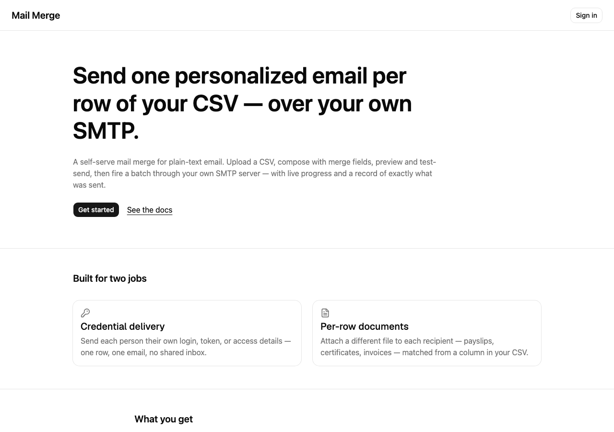

# Mail Merge

CSV-driven, plain-text mail merge over your own SMTP — a self-serve web app that
sends one personalized email per row of your spreadsheet, through _your_ mail
server. No shared sending infrastructure, no rich-text, no lock-in.

Repository: <https://github.com/robindarlington/mail-merge>



## What it is

A signed-in user onboards their own SMTP server (validated as working during
onboarding), uploads a CSV, composes a plain-text email with merge-field
autocomplete drawn from the CSV's columns, previews and test-sends the merge,
then fires a background batch that sends one personalized email per row — with
live per-recipient progress and a saved record of exactly what was sent and to
whom.

It grows out of a single-file Node.js CLI (`send-credentials.ts`) that already
performed the core merge-and-send logic, generalized here into a multi-tenant
web product. The same engine still ships as a standalone
[CLI and MCP server](packages/cli/README.md).

## Who it's for

Built for two jobs:

- **Credential delivery** — send each person their own login, token, or access
  details: one row, one email, no shared inbox.
- **Per-row documents** — attach a different file to each recipient (payslips,
  certificates, invoices), matched from a column in your CSV.

## Features

- Your own SMTP, verified with `transport.verify()` before any send.
- Merge-field autocomplete for the subject and body.
- Row-by-row preview with empty-value warnings.
- Whole-batch test-send to a single address before you commit.
- A confirmation gate before every live send.
- Live per-recipient progress and a downloadable record of the run.
- A [CLI and MCP server](packages/cli/README.md) for agents and scripts.

Bring your own SMTP. Credentials are encrypted at rest (AES-256-GCM). No shared
sending infrastructure, no tracking pixels, no lock-in.

## Quickstart (local dev)

Requires Node.js **>= 24**.

```bash
git clone https://github.com/robindarlington/mail-merge.git
cd mail-merge
npm install
cp .env.example .env   # then fill in the values (see the comments in that file)
npm run dev
```

Open <http://localhost:3000>. `.env.example` is the complete, documented contract
for every variable the app reads — Clerk auth keys, the AES-256-GCM credential
key, the SQLite path, and the background-worker knobs. Never commit your real
`.env` (it is gitignored).

## Self-host

Mail Merge is designed to run containerized on a VPS (Coolify) with a single
WAL-mode SQLite file shared by the web app and a long-lived Node worker. The
in-app [`/self-host`](app/(marketing)/self-host/page.tsx) page walks through
the Docker/Coolify deployment shape and the environment-variable contract, and
[`.env.example`](.env.example) is the complete, documented reference for every
variable the app reads (variable names and semantics only — no secrets are ever
printed).

## CLI & MCP

The merge-and-send engine also ships as a standalone package with two
front-ends:

- **CLI** — `npx @robindarlington/mail-merge …` for humans and scripts.
- **MCP server** — `mail-merge mcp` exposes the engine to Claude Desktop and
  other MCP clients as typed tools, behind a two-step send-confirmation gate.

See [`packages/cli/README.md`](packages/cli/README.md) for the full CLI options
and MCP client config, and the in-app [`/agents`](app/(marketing)/agents/page.tsx)
page for a quick tour.

## License

[MIT](LICENSE).

## Author

Built by **Robin Darlington**. I turn spreadsheets and manual workflows into
small, reliable tools like this one. If you have a CSV-shaped problem you'd like
automated, [get in touch](https://robindarlington.com/contact/).
